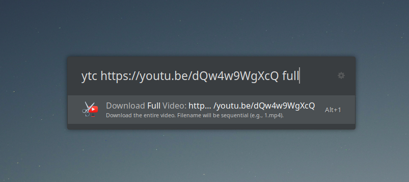

# YouTube Video Cutter (Ulauncher Extension)

A Ulauncher extension to easily cut segments from YouTube videos or download entire YouTube videos.

## Features

*   **Cut Video Segments:** Specify start and end times to extract a portion of a YouTube video.
*   **Download Full Videos:** Download the complete YouTube video, using its title as the filename.
*   **Flexible Time Input:** Use intuitive time formats like `1m30s`, `2h5m`, `45s`, or the standard `HH:MM:SS`.
*   **Configurable Output Directory:** Choose where your cut or downloaded videos are saved (defaults to `~/Downloads`).
*   **Auto-Open Directory:** Optionally, have the output directory open automatically after a successful operation.

## Prerequisites

Ensure you have the following command-line tools installed and accessible in your system's PATH:

*   **`yt-dlp`**: Used for downloading video information and content from YouTube.
*   **`ffmpeg`**: Used for cutting the video segments.

You can typically install these using your system's package manager (e.g., `apt`, `brew`, `dnf`, `pacman`).

## Usage

The default keyword to trigger the extension is `ytc`. You can change this in the extension preferences.

### Cutting a Video Segment

To cut a video, use the following format:
`<keyword> <youtube_url> <start_time> <end_time>`

*   **`<youtube_url>`**: The full URL of the YouTube video.
*   **`<start_time>`**: The start time for the cut (e.g., `1m30s`, `00:01:30`).
*   **`<end_time>`**: The end time for the cut (e.g., `2m15s`, `00:02:15`).

**Example:**
`ytc https://www.youtube.com/watch?v=dQw4w9WgXcQ 0m5s 0m15s`

### Downloading a Full Video

To download an entire video, use the following format:
`<keyword> <youtube_url> full`

**Example:**
`ytc https://www.youtube.com/watch?v=dQw4w9WgXcQ full`

The video will be saved with a filename derived from its title in your configured output directory.

## Preferences

You can configure the following in the Ulauncher extension settings:

*   **YouTube Cutter Keyword:** The keyword to activate the extension (default: `ytc`).
*   **Output Directory:** The folder where cut/downloaded videos will be saved (default: `~/Downloads`).
*   **Auto-open Output Directory:** Whether to automatically open the output directory in your file manager after a video is processed (default: enabled).

## License

This project is licensed under the MIT License - see the [LICENSE](LICENSE) file for details.
